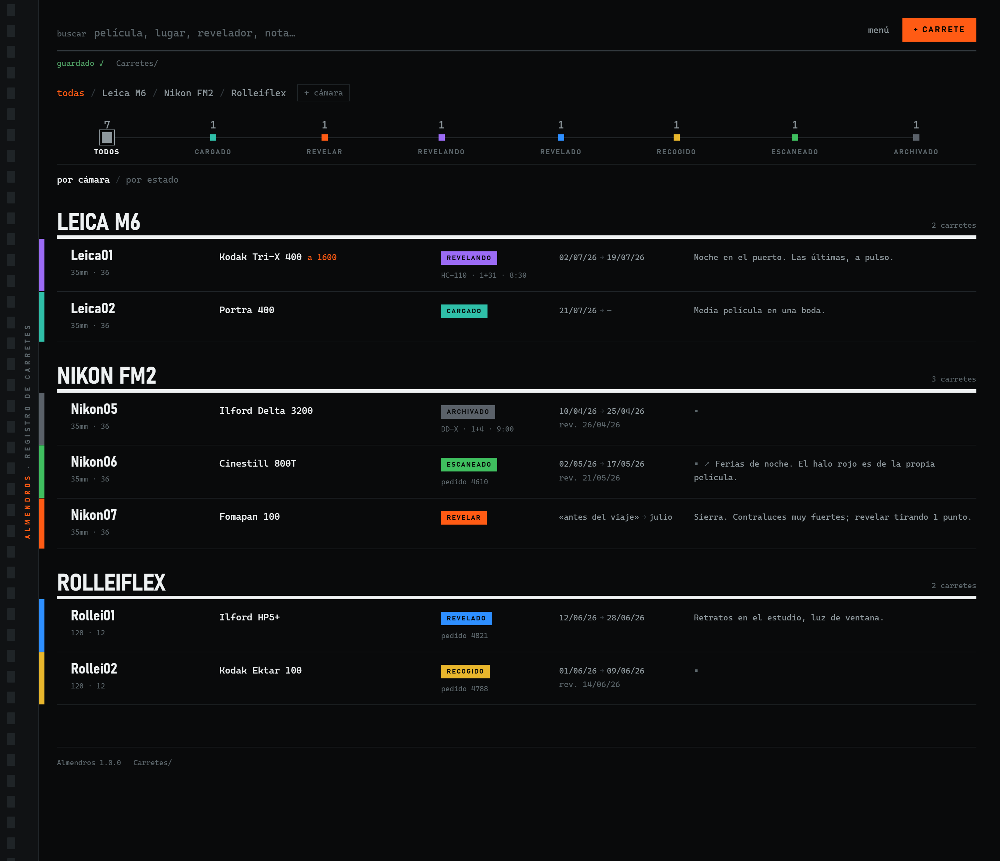
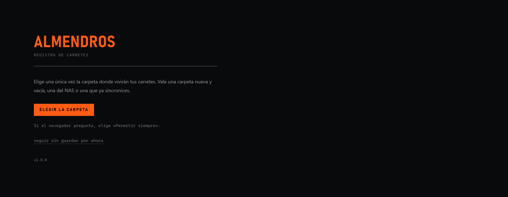
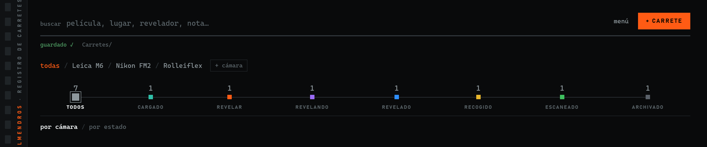
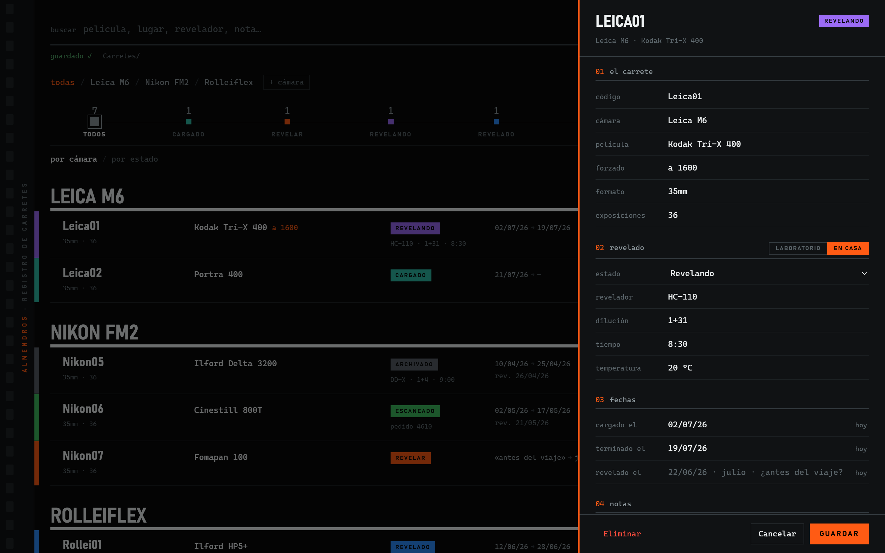
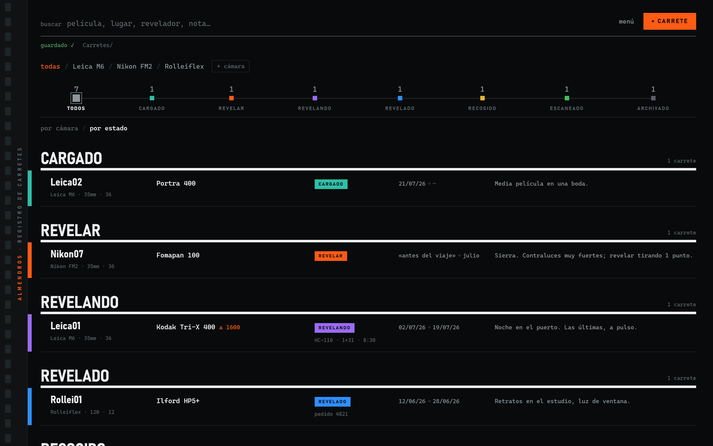
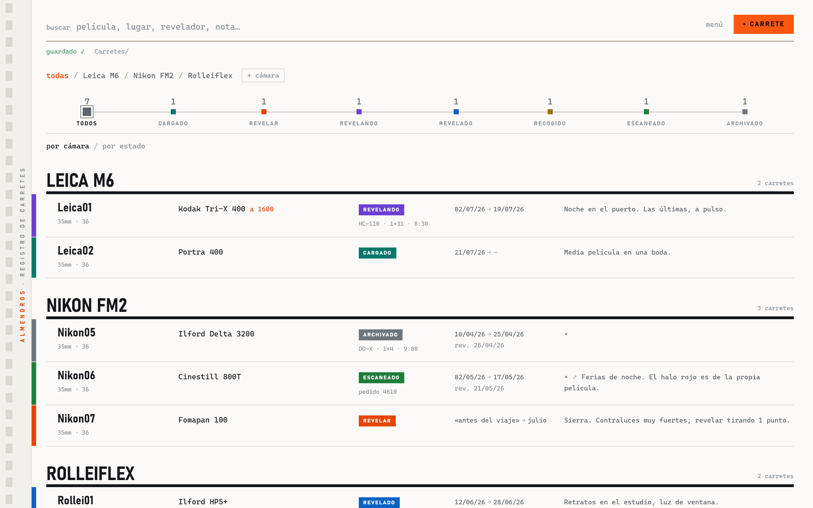
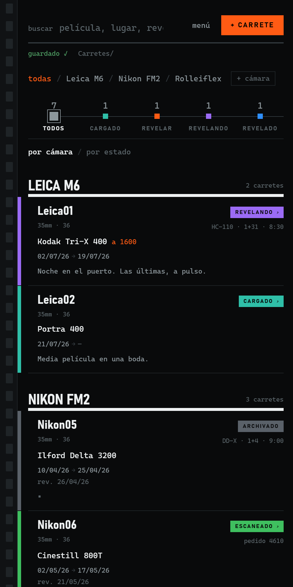

<p align="center">
  
</p>

# 🎞️ Almendros — registro de carretes en un solo archivo

**Lleva la cuenta de todos tus carretes de película**: cuál llevas en cada cámara, qué
película es, si va forzado, si lo revela el laboratorio o tú en casa, cuándo vuelve y —lo
que no apunta nadie— *dónde acabó el negativo*. Almendros es un cuaderno de carretes para
fotografía analógica que cabe en un archivo HTML y guarda en una carpeta tuya.

Sin cuenta. Sin servidor. Sin cuotas. Sin rastreo. Carretes ilimitados.

<p>
  <a href="LICENSE"></a>
  
  
  <a href="https://jaimealekos.github.io/almendros/#demo"></a>
</p>

**[▶ Probar la demostración](https://jaimealekos.github.io/almendros/#demo)** (carretes de
ejemplo, no se guarda nada) · **[Abrir la aplicación](https://jaimealekos.github.io/almendros/)** ·
**[Read me in English](README.md)**

---

## Antes de nada — tres límites honestos

Casi ningún cuaderno de carretes cuenta su letra pequeña. Aquí va la nuestra, por delante:

1. **Para guardar en una carpeta hace falta un navegador de ordenador**: Chrome, Edge o
   Brave, en Windows, macOS o Linux. Firefox y Safari todavía no saben escribir en carpetas.
2. **En el móvil funciona, pero no puede guardar en una carpeta.** Todo se queda dentro del
   navegador y la copia la descargas tú. Es una herramienta de mesa, no de bolsillo.
3. **No apunta foto a foto.** Ni el diafragma de cada disparo ni GPS.
   [Es a propósito](#por-qué-no-foto-a-foto).

Si alguno de los tres te echa para atrás, más abajo hay
[otras herramientas honestamente recomendadas](#otras-herramientas-que-merece-la-pena-conocer).

---

## Para qué sirve

Cargas un carrete. Lo disparas durante tres semanas. Se queda en un cajón. Lo llevas al
laboratorio. Vuelve. Lo escaneas. Dos años después quieres ese fotograma — y el negativo
está en una de once fundas sin marcar.

Almendros es el hilo que atraviesa todo eso. Responde a las dos preguntas que se hace
cualquier fotógrafo de película:

- **«¿Qué carrete llevo en esta cámara, y lo estaba tirando a su ISO?»**
- **«¿Dónde demonios archivé ese negativo?»**

Diez segundos por carrete. Ese es todo el compromiso.

---

## Manual

Almendros es un cuaderno para tus carretes. Apuntas cuál llevas en cada cámara, qué película
es, cómo lo revelaste y dónde acabó el negativo. Nada más.

No hay que instalar nada, ni registrarse, ni pagar. Es un solo archivo. En cinco minutos lo
tienes andando.

### Cinco minutos y ya está

**1. Descarga el archivo.**
Baja [`index.html`](https://raw.githubusercontent.com/jaimealekos/almendros/main/index.html)
(botón derecho → Guardar enlace como) y déjalo donde quieras: el escritorio, Documentos, un
pincho USB. Ese archivo es la aplicación entera. También puedes usarla directamente en
[jaimealekos.github.io/almendros](https://jaimealekos.github.io/almendros/), sin descargar
nada: guarda igualmente en tu carpeta.

**2. Ábrelo con doble clic.**
Se abre como una página web. Usa **Chrome**, **Edge** o **Brave**, y en un ordenador: son
los únicos que saben escribir en una carpeta tuya.

**3. Elige la carpeta.**
La primera vez verás esto:



Pulsa **Elegir la carpeta** y señala dónde quieres que vivan tus carretes. Vale una carpeta
nueva y vacía, una del disco de red o una que ya sincronices. Si sale una pregunta, elige
«Permitir siempre». Esto se hace una sola vez en cada ordenador.

Si usas Brave, ese permiso viene apagado de fábrica. La propia página lo detecta y te enseña
los tres pasos para encenderlo.

**4. Añade tu primer carrete.**
Arriba a la derecha, **+ Carrete**. Se abre una ficha por el lado derecho. Con tres cosas
basta: **código**, **cámara** y **película**. El código es el nombre corto del carrete —
`Leica01`, `Yashica10`—; si eliges la cámara, Almendros ya te propone el número siguiente.
Si la cámara es nueva, la añades con **+ cámara**.

Pulsa **Guardar**. Arriba pondrá «guardado ✓» y el carrete ya está en tu carpeta.


Eso era toda la instalación. Lo de abajo puedes leerlo otro día.

### El único gesto que hay que aprender

Cada carrete está siempre en una fase, y cada fase tiene su color:

**Cargado** (turquesa) → **Revelar** (naranja) → **Revelando** (violeta) → **Revelado**
(azul) → **Recogido** (ámbar) → **Escaneado** (verde) → **Archivado** (plata).

**Pulsa la etiqueta de color y el carrete pasa a la fase siguiente.** No hace falta abrir
nada. Si te equivocas, abajo aparece un aviso con **Deshacer** — vale para los cambios de
estado, para los carretes borrados y para las cámaras quitadas.



Los números de arriba dicen cuántos carretes hay ahora mismo en cada fase. Pulsa uno y verás
solo esos. Es la respuesta rápida a «¿qué tengo pendiente?».

En la ficha sí hay botón **Guardar**; fuera de ella, cada cambio se escribe solo.

### El viaje de un carrete

1. **Lo cargas.** Queda en turquesa. A partir de aquí, un vistazo a la lista te dice qué
   película llevas puesta en cada cuerpo. Esa es media aplicación.
2. **Disparas.** Aquí no hay nada que hacer, y es a propósito. Si acaso, abre el carrete y
   escribe en **notas** lo que querrás recordar, y si lo forzaste ponlo en **forzado**
   («a 1600»): es el dato que más se olvida.
3. **Lo terminas.** Pulsas la etiqueta y pasa a **Revelar**. El naranja es lo único que te
   reclama algo: es tu lista de la compra.
4. **Lo revelas.** En la ficha, apartado **revelado**, eliges **Laboratorio** (nombre y nº de
   pedido) o **En casa** (revelador, dilución, tiempo, temperatura). Apunta lo que hiciste de
   verdad, no lo que decía la tabla.



5. **Lo recoges.** Solo si fue al laboratorio: lo que revelas en casa se salta esa fase.
6. **Lo escaneas.** En el campo **escaneos** pega la carpeta o el enlace donde han quedado
   las imágenes.
7. **Lo archivas.** Guarda el negativo en su funda y escribe en **dónde está** exactamente
   eso: «Archivador 2 · funda 14».

Tres años después escribes «Ektar» en el buscador y sabes en qué archivador y en qué funda
está ese negativo. Ese es el motivo entero de llevar un cuaderno.

### Cuando ya tengas unos cuantos

La lista se agrupa **por cámara** —para saber qué llevas puesto— o **por estado** —para
saber qué te toca hacer—. Se cambia con los dos enlaces bajo la fila de colores.



- **Buscar** — el campo de arriba mira dentro de todo: película, cámara, revelador,
  laboratorio, notas, archivador.
- **Fechas a tu manera** — se escriben a mano y admiten cualquier cosa: `22/06/26`, `julio`,
  `¿antes del viaje?`. Al lado hay un **hoy** para cuando quieras la fecha exacta.
- **Menú** (arriba a la derecha) — descargar una copia, exportar a hoja de cálculo, imprimir
  el registro para llevarlo al laboratorio, cambiar de carpeta, pasar de oscuro a claro y de
  español a inglés. El idioma solo cambia lo que ves: el archivo de tus carretes no se toca.
- **Atajos** — `N` carrete nuevo · `/` buscar · `Esc` cerrar o limpiar · `Ctrl+Intro`
  guardar la ficha.



### Si algo va raro

- Arriba pone siempre cómo va: «guardado ✓», «guardando…» o un aviso si no ha podido
  escribir. Si sale el aviso, no se pierde nada: el cambio espera y se escribe en cuanto la
  carpeta vuelva a estar disponible.
- ¿Moviste la carpeta de sitio? Menú → «Cambiar de carpeta…».
- ¿Quieres mirar antes de decidirte? Añade `#demo` al final de la dirección: verás carretes
  de ejemplo y no se guarda nada.

---

## Tus datos

Viven en **un archivo de texto normal** llamado `almendros.json`, dentro de la carpeta que
elegiste, con una copia diaria en `copias/`.

```
tu carpeta/
├── almendros.json      ← todos los carretes que has disparado
└── copias/             ← copias diarias, se conservan 30
```

Puedes abrirlo con el Bloc de notas y entenderlo leyéndolo. **Si mañana este proyecto
desapareciera, tu registro seguiría ahí, legible, sin mí.** Ese es el sentido entero del
formato.

**Varios ordenadores, una carpeta.** Ponla en un disco de red o en una carpeta sincronizada
y abre la página donde quieras. Almendros fusiona carrete a carrete —cada uno sabe cuándo se
tocó por última vez y cada borrado deja su marca—, así que dos ordenadores que editan
carretes distintos conservan los dos su trabajo. Lo único que no sabe resolver: si editas el
mismo carrete a la vez en dos sitios, gana el último que escriba.

**Sin conexión no pasa nada.** Si la carpeta no está accesible, los cambios esperan en el
navegador y se escriben en cuanto vuelva.

## Por qué no foto a foto

Porque no lo vas a mantener. Quien lo ha intentado sabe cómo acaba: la hoja de cálculo se
abre con buenas intenciones y se abandona al tercer carrete. Nadie se para en mitad de la
calle a teclear un diafragma.

Un carrete se apunta en diez segundos, que es justo el motivo por el que sí lo vas a hacer
—y el carrete es la unidad que importa de todas formas: es lo que maneja el laboratorio, lo
que cabe en la funda y lo que se pierde.



## Otras herramientas que merece la pena conocer

Almendros no intenta ser todo. Si quieres algo que a propósito no hace, estas son buenas y
deberías usarlas — con ella o en su lugar:

- **[Exif Notes](https://github.com/tommi1hirvonen/ExifNotes)** — código abierto, Android.
  Apunta foto a foto y sabe escribir los datos EXIF dentro de tus escaneos.
- **[Massive Dev Chart](https://www.digitaltruth.com/devchart.php)** — la base de tiempos de
  revelado y su temporizador. Almendros anota la receta que usaste; esto te dice cuál debería
  ser.
- **[Crown + Flint](https://crownandflint.com/)**, **[Pellica](https://pellica.app/)**,
  **[Frames](https://withframes.com/)** — aplicaciones de móvil muy cuidadas, con fotómetro y
  registro sobre la marcha. Si quieres apuntar mientras caminas, coge una de estas.
- **[Filmbook](https://flathub.org/apps/io.github.nate_xyz.Filmbook)** — aplicación nativa de
  Linux con una filosofía parecida, a nivel de carrete.

Lo que te da Almendros y esas no: es código abierto, no cuesta nada, no tiene cuenta ni
límites, funciona en cualquier ordenador y tu registro es un archivo tuyo.

## Desarrollo

Todo está en `index.html`: CSS, HTML y un único script sin dependencias. Sin compilar, sin
red en tiempo de ejecución — tiene que funcionar desde `file://` con el wifi apagado. Para
trabajar en él, ábrelo. Ese es todo el instrumental.

- **`index.html#pruebas`** ejecuta las pruebas internas en la propia página: lógica de
  fusión, migraciones desde todos los formatos históricos, numeración de códigos y escapado
  del CSV.
- **`index.html#demo`** carga carretes de ejemplo en memoria y no guarda nada.

Se agradecen ideas y avisos de fallos, sobre todo de quien revela en casa.

## Licencia

[MIT](LICENSE) — libre para usar, copiar, mejorar y compartir.

---

Apuntar un carrete lleva diez segundos, que es justo el motivo por el que lo vas a hacer de
verdad.
