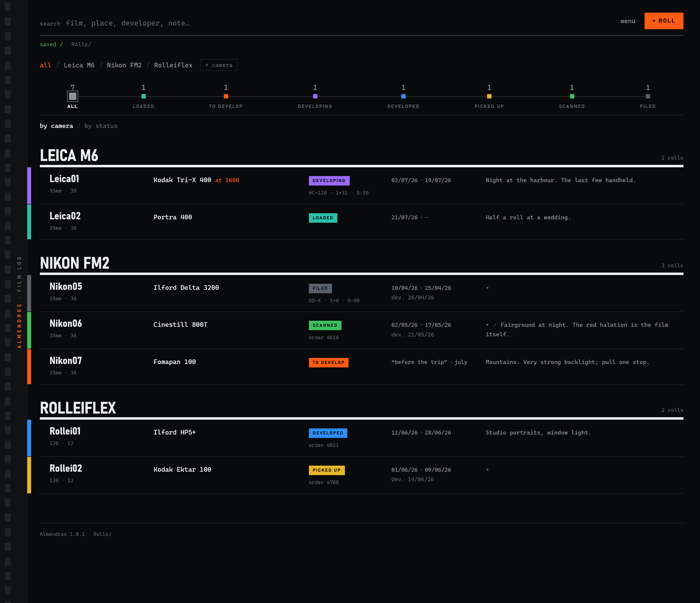
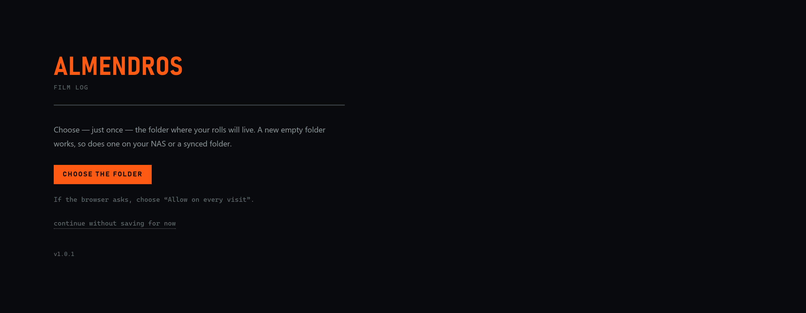
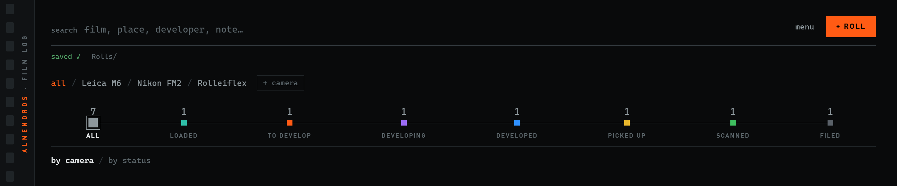
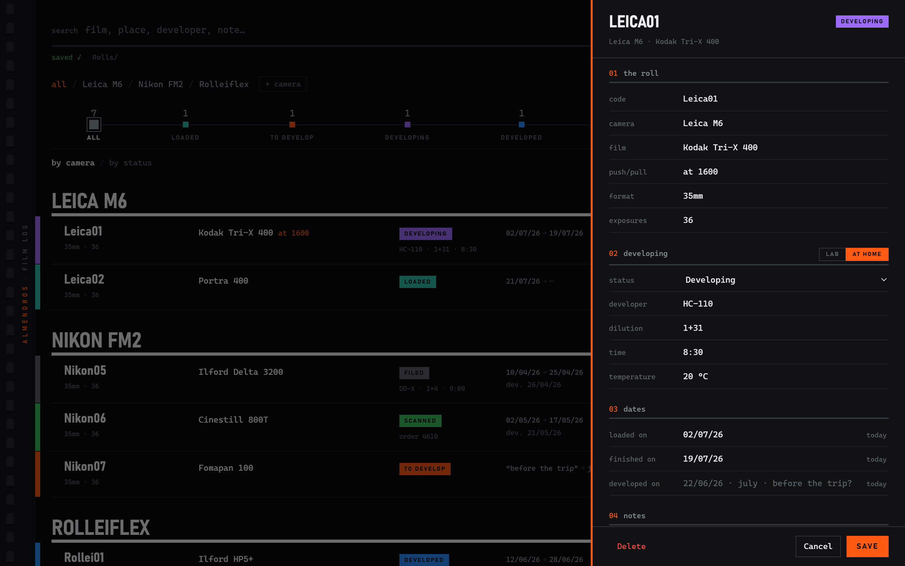
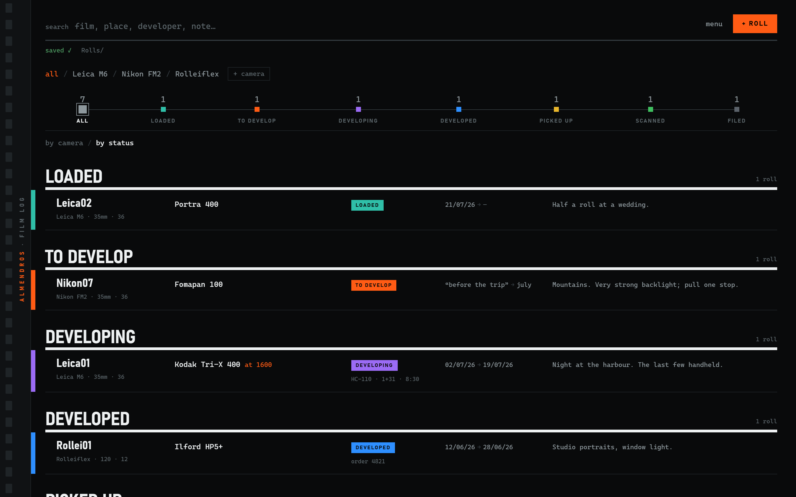
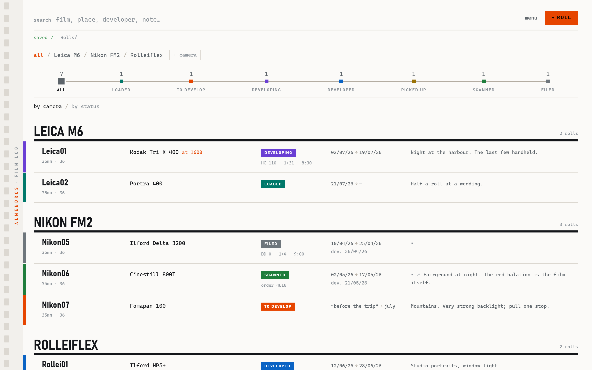
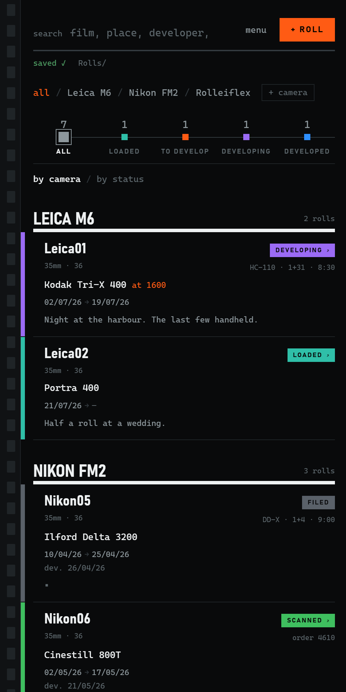

<p align="center">
  
  <a href="LEEME.md"></a>
</p>

<p align="center">
  
</p>

# 🎞️ Almendros — a film photography logbook in a single HTML file

**Track every roll of film you shoot** — which camera it's loaded in, what stock, push or
pull, whether it went to a lab or into your own tank, when it comes back, and *where the
negative ended up*. Almendros is a film log for analog (analogue) photographers that runs
from one HTML file and saves to a folder you own.

No account. No server. No subscription. No telemetry. Unlimited rolls.

<p>
  <a href="LICENSE"></a>
  
  
</p>

**[▶ Try the demo](https://jaimealekos.github.io/almendros/?lang=en#demo)** (sample rolls,
nothing saved) · **[Open the app](https://jaimealekos.github.io/almendros/?lang=en)** ·
**[Jump to the manual](#manual)**

---

## Before anything else — three honest limits

Most film logs hide their catch. Here are ours, up front:

1. **Saving to a folder needs a desktop browser**: Chrome, Edge or Brave on Windows, macOS
   or Linux. Firefox and Safari can't write to folders yet.
2. **On a phone it runs, but it can't save to a folder.** Everything stays inside the
   browser and you download a copy when you want one. It is a desk tool, not a pocket one.
3. **It does not log frame by frame.** No aperture and shutter speed for every shot, no GPS.
   [That's deliberate](#why-not-frame-by-frame).

If any of those is a dealbreaker, [there are good apps that do it differently](#other-tools-worth-knowing)
— honestly listed below.

---

## What it's for

You load a roll. You shoot it over three weeks. It sits in a drawer. You send it to the lab.
It comes back. You scan it. Two years later you want that one frame — and the negative is in
one of eleven sleeves with no markings.

Almendros is the thread through all of that. It answers the two questions every film
photographer asks:

- **"What's in this camera, and was I shooting it at box speed?"**
- **"Where the hell did I file that negative?"**

Ten seconds per roll. That's the whole commitment.

---

## Manual

Almendros is a notebook for your rolls. You write down which one is in each camera, what
film it is, how you developed it and where the negative ended up. Nothing else.

There is nothing to install, no sign-up and no payment. It is a single file. Five minutes
and it's running.

### Five minutes and you're done

**1. Download the file.**
Grab [`index.html`](https://raw.githubusercontent.com/jaimealekos/almendros/main/index.html)
(right-click → Save link as) and leave it wherever you like: the desktop, Documents, a USB
stick. That file is the entire application. You can also use it straight from
[jaimealekos.github.io/almendros](https://jaimealekos.github.io/almendros/?lang=en) without
downloading anything: it still saves into your own folder.

**2. Open it with a double click.**
It opens like a web page. Use **Chrome**, **Edge** or **Brave**, on a computer: they are the
only ones that can write into a folder of yours.

**3. Choose the folder.**
The first time you'll see this:



Click **Choose the folder** and point at where you want your rolls to live. A new empty
folder is fine, so is one on your NAS or one you already sync. If a question pops up, choose
"Allow on every visit". You do this once per computer.

If you use Brave, that permission ships switched off. The page detects it and shows you the
three steps to turn it on.

**4. Add your first roll.**
Top right, **+ Roll**. A card slides in from the right. Three things are enough: **code**,
**camera** and **film**. The code is the roll's short name — `Leica01`, `Yashica10`; if you
pick the camera, Almendros already suggests the next number. If the camera is new, add it
with **+ camera**.

Click **Save**. Up top it will say "saved ✓" and the roll is already in your folder.


That was the whole installation. The rest can wait for another day.

### The one gesture worth learning

Every roll is always at some stage, and every stage has its colour:

**Loaded** (teal) → **To develop** (orange) → **Developing** (violet) → **Developed** (blue)
→ **Picked up** (amber) → **Scanned** (green) → **Filed** (silver).

**Click the coloured label and the roll moves to the next stage.** No need to open anything.
If you get it wrong, a notice appears at the bottom with **Undo** — it works for status
changes, deleted rolls and removed cameras.



The numbers along the top say how many rolls are at each stage right now. Click one and you
see only those. It's the quick answer to "what's outstanding?".

Inside the card there is a **Save** button; outside it, every change writes itself.

### The journey of a roll

1. **You load it.** It turns teal. From here on, one glance at the list tells you what film
   is in each body. That's half the application right there.
2. **You shoot.** Nothing to do here, and that's on purpose. If anything, open the roll and
   write in **notes** whatever you'll want to remember, and if you pushed it put that in
   **push/pull** ("at 1600"): it's the most forgotten detail of all.
3. **You finish it.** Click the label and it moves to **To develop**. Orange is the only
   colour that asks something of you: it's your shopping list.
4. **You develop it.** In the card, section **developing**, you choose **Lab** (name and
   order number) or **At home** (developer, dilution, time, temperature). Write down what
   you actually did, not what the chart said.



5. **You pick it up.** Only if it went to a lab: rolls you develop at home skip that stage.
6. **You scan it.** In the **scans** field paste the folder or the link where the images
   ended up.
7. **You file it.** Put the negative in its sleeve and write exactly that in **storage**:
   "Binder 2 · sleeve 14".

Three years later you type "Ektar" into the search box and you know which binder and which
sleeve that negative is in. That is the entire reason for keeping a logbook.

### Once you have a few

The list groups **by camera** — to know what's loaded — or **by status** — to know what you
have to do. You switch with the two links under the row of colours.



- **Search** — the field at the top looks inside everything: film, camera, developer, lab,
  notes, binder.
- **Dates your way** — you type them by hand and anything goes: `22/06/26`, `july`,
  `before the trip?`. Next to each one there's a **today** for when you want the exact date.
- **Menu** (top right) — download a copy, export to a spreadsheet, print the log to take to
  the lab, change folder, switch between dark and light and between English and Spanish. The
  language only changes what you see: your file of rolls is never touched.
- **Shortcuts** — `N` new roll · `/` search · `Esc` close or clear · `Ctrl+Enter` save the
  card.



### If something looks wrong

- Up top it always says how things are going: "saved ✓", "saving…" or a warning if it
  couldn't write. If the warning appears, nothing is lost: the change waits and is written
  as soon as the folder is reachable again.
- Moved the folder? Menu → "Change folder…".
- Want a look before committing? Add `#demo` to the end of the address: you'll see sample
  rolls and nothing is saved.

---

## Your data

Everything lives in **one plain text file** called `almendros.json`, inside the folder you
chose, with a daily backup in `copias/`.

```
your folder/
├── almendros.json      ← every roll you have ever shot
└── copias/             ← daily backups, last 30 kept
```

You can open it in Notepad and understand it by reading it. **If this project disappears
tomorrow, your log is still there, still legible, without me.** That's the whole point of
the format.

**Several computers, one folder.** Put it on a NAS or a synced drive and open the page
anywhere. Almendros merges roll by roll — each roll knows when it was last touched and each
deletion leaves a marker — so two computers editing different rolls both keep their work.
The one thing it can't resolve: if you edit the *same* roll in two places at once, the last
write wins.

**Offline is fine.** If the folder is unreachable, changes wait in the browser and are
written the moment it's back.

## Why not frame by frame?

Because you won't keep it up. Everyone who has tried a per-frame log knows how it ends: the
spreadsheet gets opened with good intentions and abandoned by roll three. Nobody stops
mid-street to type an aperture.

A roll takes ten seconds to log, which is why you'll actually do it — and the roll is the
unit that matters anyway. It's what the lab handles, what the sleeve holds, and what you
lose.



## Other tools worth knowing

Almendros doesn't try to be everything. If you want something it deliberately doesn't do,
these are good and you should use them — alongside it or instead of it:

- **[Exif Notes](https://github.com/tommi1hirvonen/ExifNotes)** — open source, Android.
  Frame-by-frame notes and it can write EXIF into your scans.
- **[Massive Dev Chart](https://www.digitaltruth.com/devchart.php)** — the development-time
  database and timer. Almendros records the recipe you used; this tells you what it should be.
- **[Crown + Flint](https://crownandflint.com/)**, **[Pellica](https://pellica.app/)**,
  **[Frames](https://withframes.com/)** — polished mobile apps with light meters and
  in-the-field logging. If you want to log while you walk, get one of these.
- **[Filmbook](https://flathub.org/apps/io.github.nate_xyz.Filmbook)** — a native Linux app
  with a similar roll-level philosophy.

What Almendros gives you that those don't: it's open source, it costs nothing, it has no
account and no limits, it runs on any desktop, and your log is a plain file you own.

## Development

Everything is in `index.html`: CSS, markup and one vanilla script. No build step, no
dependencies, no network access at runtime — it has to work from `file://` with the wifi
off. To work on it, open the file. That's the whole toolchain. See
[ARQUITECTURA.md](ARQUITECTURA.md) for the data model and the invariants.

- **`index.html#pruebas`** runs the built-in test suite in the page — merge logic,
  migrations from every historical file format, code numbering, CSV escaping.
- **`index.html#demo`** loads sample rolls in memory and saves nothing.
- **`python capturas/generar.py`** regenerates the manual screenshots in both languages.

Bug reports and ideas are welcome, especially from photographers who develop at home.

## Licence

[MIT](LICENSE) — free to use, copy, improve and share.

---

Logging a roll takes ten seconds, which is exactly why you'll actually do it.
